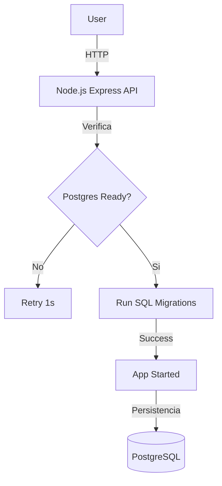

# 🚀 Node DevOps Platform
[](https://github.com/ceomsaro/Node.js-PostgreSQL-Docker-Migraciones-Tests-CI-CD-Deploy/actions/workflows/ci.yml)


Una API profesional de gestión de tareas diseñada bajo principios **DevOps**: automatización, seguridad y observabilidad.

## 🏗️ Arquitectura del Sistema



## 🛠️ Stack Tecnológico
- Backend: Node.js & Express.

- Base de Datos: PostgreSQL.

- Infraestructura: Docker & Docker Compose.

- CI/CD: GitHub Actions.

- Testing: Jest & Supertest.

## 🌟 Características DevOps
Migraciones Automáticas: Script de entrada que espera a la DB y ejecuta esquemas SQL (psql).

- Seguridad (Hardening): El contenedor corre bajo un usuario no-root (node).

- Healthchecks: Endpoint /health que valida la conectividad interna con la base de datos.

- Persistencia: Volúmenes Docker gestionados para evitar pérdida de datos.

- CI Pipeline: Ejecución automática de tests en cada push a main.

## 🚀 Cómo empezar

Clonar el repo:
```bash
git clone https://github.com/ceomsaro/Node.js-PostgreSQL-Docker-Migraciones-Tests-CI-CD-Deploy.git
```


Variables de entorno: Copia `.env.example` a `.env` y ajusta tus credenciales.

Levantar el entorno:
```bash
docker-compose up --build
```

## 🧪 Testing
Para ejecutar la suite de pruebas dentro del entorno orquestado:
```bash
docker-compose exec api npm test
```


## 🛡️ Seguridad
Este proyecto sigue las mejores prácticas de Docker:

- Uso de imágenes Alpine (ligeras y con menor superficie de ataque).

- Principio de Menor Privilegio (No-root user).

- Gestión de secretos mediante variables de entorno (no hardcoded).
